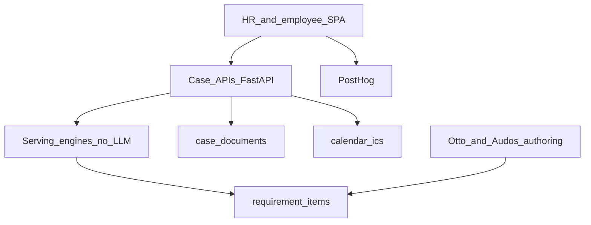

# Relocation OS — ReloPass as it exists

Karpathy’s LLM-OS analogy is a **pitch frame**. The map below is the shipped stack, not the v2 peripherals.

| OS metaphor | ReloPass component | Status |
|---|---|---|
| Kernel | Case create/read, requirement checklist, roadmap view | Shipped |
| Disk | Document vault (`/api/cases/{id}/documents`) | Shipped (per-row upload) |
| Long-term memory | `public.requirement_items` + changelog | Serving + history |
| Scheduler | Corridor `scheduler.py` + suggested lead times | Partial vs legal `deadline_rule` DSL |
| Peripherals | HRIS, chatbot, vendor marketplace | Not v0 |

**Trust boundary:** serving engines must not import an LLM. Isolation: `scripts/check_serving_llm_isolation.py`.
