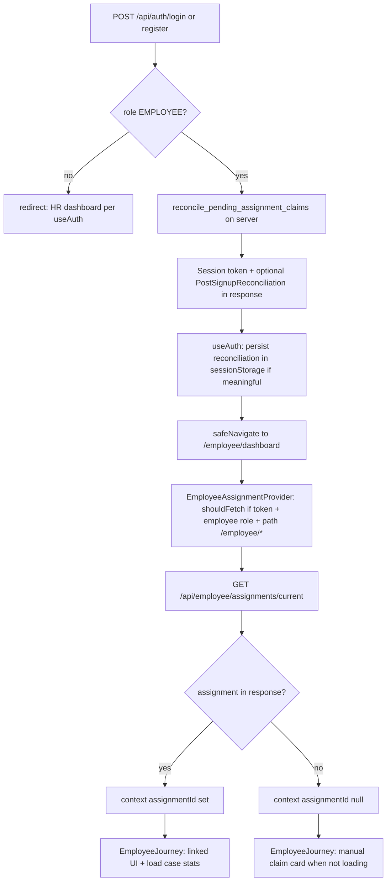

# Employee post-login / entry flow — audit

This document describes **current** behavior (as of this audit) for employee authentication, routing, assignment resolution, and claim/invite flows. It is intended as a baseline before changing assignment-linking or “pending assignment” behavior.

---

## 1. Direct answers to the audit questions

### 1.1 How does the app decide today whether an employee has a linked assignment?

**Server source of truth**

- A relocation assignment is **linked** to an employee when the row in `case_assignments` has `employee_user_id` set to that user’s id (after HR provisioning, auto-reconcile, or manual claim).

**What the client uses**

- The SPA calls **`GET /api/employee/assignments/current`**, implemented in `backend/main.py` as `get_employee_assignment`.
- Before returning, the handler may run **`_best_effort_reconcile_employee_assignments`**, which calls **`reconcile_pending_assignment_claims`** (`backend/services/assignment_claim_link_service.py`) to attach matching unassigned rows.
- The response is whatever **`db.get_assignment_for_employee(employee_user_id)`** returns.

**DB selection rule**

- `get_assignment_for_employee` runs:

  `SELECT * FROM case_assignments WHERE employee_user_id = :emp ORDER BY created_at DESC LIMIT 1`

  So “current” is **implicitly the most recently created** linked assignment if there are several.

**Client state**

- `EmployeeAssignmentProvider` (`frontend/src/contexts/EmployeeAssignmentContext.tsx`) stores a single **`assignmentId`** from `res.assignment?.id` (or `null`), with **`employeeAPI.getCurrentAssignment()`** + `cachedRequest('employee:current-assignment', 30_000, …)`.

### 1.2 Where does the assignment-ID entry page get triggered?

There is **no dedicated route** for “assignment ID only.” The manual flow lives **inside** the employee dashboard component:

- **Route:** `/employee/dashboard` → `EmployeeJourney` (`frontend/src/App.tsx`).
- **UI condition:** After assignment resolution finishes (`!assignmentLoading`), if **`assignmentId` is null**, `EmployeeJourney` renders the **“Link your case manually”** card (email/username + assignment UUID + claim button).
- While **`assignmentLoading`** is true, that card is **not** shown; a bootstrap/loading state is shown instead.

Post-login navigation does **not** branch on assignment: employees always go to the dashboard route first (see §2).

### 1.3 Is there a distinction between linked assignments and pending / unclaimed assignments?

**Yes, but mostly on the server and in one-off UX payloads—not as a first-class employee API shape.**

| Concept | Where it lives | How it surfaces |
|--------|----------------|-----------------|
| **Linked** | `case_assignments.employee_user_id = user` | `GET /api/employee/assignments/current` returns that row (subject to `LIMIT 1` ordering). |
| **Unassigned / claimable** | `employee_user_id` null, matched by `employee_identifier` / `employee_contacts` / legacy lists | **`reconcile_pending_assignment_claims`** attaches them on login, signup, and best-effort on employee routes. |
| **Claim invites** | `assignment_claim_invites` (`pending` / `claimed` / `revoked`) | Revoked-only state can **block auto-attach** (`is_assignment_auto_claim_blocked_by_revoked_invites`). Manual claim also checks this. |
| **“Connected but no case yet”** | Contact linked, no assignment attached | `PostSignupReconciliation` can include `linkedContactIds` without `attachedAssignmentIds`; `EmployeeJourney` shows a “waiting for HR” style badge/message. |

The client does **not** maintain a durable list of “pending” assignments from the server; it infers “no link” from **`assignmentId === null`** after `/current`.

### 1.4 What happens if a user has more than one assignment?

- **Backend “current”:** Only **one** row is returned: latest by `created_at` among rows with that `employee_user_id`.
- **Reconcile:** `ClaimLinkResult.newly_attached_assignment_ids` can contain **multiple** IDs if several unassigned rows were attached in one reconcile; signup/login may return **`PostSignupReconciliation.attachedAssignmentIds`** (login only when **new** attachments, per `main.py` logic).
- **Frontend:** Context and nav assume a **single** `assignmentId` (e.g. `AppShell` “My case” link uses context or path). There is **no** employee-facing multi-assignment picker in this flow today.

### 1.5 What current code would conflict with a new “pending assignment” model?

High-risk / tight coupling:

1. **Single `assignmentId` in `EmployeeAssignmentContext`** — any “choose among N” or “pending until user confirms” state needs either an extended context or a new API + types.
2. **`get_assignment_for_employee` `LIMIT 1`** — product rules for “which assignment is active” are not explicit in the API; changing semantics without updating this query (or adding a new endpoint) will confuse UI and HR flows.
3. **`cachedRequest('employee:current-assignment', 30s)`** — stale “no assignment” or wrong assignment for up to TTL after server-side changes unless **`invalidateApiCache`** runs (already used on manual `claimAssignment` and refetch).
4. **Login vs signup reconciliation payloads** — login only attaches **`reconciliation` to the API response when `newly_attached_assignment_ids` is non-empty**; signup is more permissive. A pending-assignment UX cannot assume the same payload shape on every login.
5. **`AppShell` nav** — derives `assignmentId` from context **or** path; multiple assignments without a clear “selected” id will produce inconsistent “My case” targets.
6. **Canonical link service** — `assignment_claim_link_service.reconcile_pending_assignment_claims` is documented as the **canonical** auto-link path (`backend/services/identity_canonical.py`). New flows should extend or compose with this rather than duplicating attach rules.

---

## 2. Current decision tree (after login)

**Not in the tree today**

- **No** automatic redirect from dashboard → wizard or summary on login (user stays on `/employee/dashboard` unless they navigate or use CTAs).
- **No** server-driven “landing URL” in the auth response for employees.

---

## 3. Assignment resolution sources (ordered)

| Stage | Mechanism | File / symbol |
|------|-----------|----------------|
| 1 | Login/signup reconcile attaches unassigned rows | `reconcile_pending_assignment_claims` from `register` / `login` in `backend/main.py` |
| 2 | Optional UX payload | `PostSignupReconciliation` on `LoginResponse`; client `sessionStorage` keys `post_auth_claim_reconciliation` / `post_signup_reconciliation` |
| 3 | Post-login redirect | `useAuth.redirectByRole` → `employeeDashboard` (`frontend/src/hooks/useAuth.ts`) |
| 4 | Client bootstrap | `EmployeeAssignmentProvider.loadAssignment` → `GET /api/employee/assignments/current` |
| 5 | Second reconcile on read | `_best_effort_reconcile_employee_assignments` inside `get_employee_assignment` before `get_assignment_for_employee` |
| 6 | Manual claim | `POST /api/employee/assignments/{id}/claim` (`claim_assignment` in `backend/main.py`); invalidates client cache key `employee:current-assignment` |

---

## 4. Pending invitation / claim logic (canonical)

- **Auto:** `reconcile_pending_assignment_claims` matches principal identifiers (email/username) to `employee_contacts` and legacy unassigned assignments, then **`attach_employee_to_assignment`** + **`mark_invites_claimed`** where appropriate.
- **Manual:** `claim_assignment` verifies the submitted identifier matches the logged-in user’s email/username, checks **`assignment_identity_matches_user_identifiers`**, blocks if revoked invites-only, then attaches.
- **Observability:** `identity_event` calls throughout auth and claim paths (`main.py`, `assignment_claim_link_service.py`).

---

## 5. Weak points / conflicts (for future design)

1. **Implicit “current” assignment** — newest `created_at` may not match HR or employee expectations when multiple relocations exist.
2. **Reconcile can attach many; UI reads one** — mismatch between multi-attach results and single `assignmentId`.
3. **Two reconcile triggers** (auth + GET current) — usually idempotent, but makes reasoning about “when does pending disappear?” harder for product.
4. **No typed “pending assignments” list API** for the dashboard — any new model needs a clear server contract.
5. **ADMIN users** — treated as `isEmployee` in context (`EMPLOYEE || ADMIN`), so they share the same `/employee` assignment fetch behavior when browsing employee routes.

---

## 6. Recommended insertion points for pending-assignment logic

These are **surgical** places to extend behavior without forking identity rules:

1. **Server — after reconcile, before or inside “current” resolution**  
   - Option A: extend **`GET /api/employee/assignments/current`** with a structured payload (`current`, `pending`, `requiresSelection`, etc.).  
   - Option B: add **`GET /api/employee/assignments`** (list) + keep `current` as a thin alias for backward compatibility.

2. **Server — `reconcile_pending_assignment_claims` / `ClaimLinkResult`**  
   - If “pending” means “matched but not yet accepted,” attach metadata here rather than inventing a parallel table without migration clarity.

3. **Client — `EmployeeAssignmentProvider`**  
   - Natural owner for “resolved assignments,” loading state, and optional **selected assignment id** (replacing or augmenting single `assignmentId`).

4. **Client — `EmployeeJourney`**  
   - Branch between: loading, **pending-assignment UI**, manual claim, and linked dashboard; already owns reconciliation banners from `sessionStorage`.

5. **Client — `AppShell`**  
   - Update “My case” and any context-derived links once a **selected** assignment id exists.

6. **Cache**  
   - Any new list or state must define **when to call `invalidateApiCache('employee:current-assignment')`** (or new keys) after mutations.

---

## 7. Existing instrumentation (no behavior change required for this audit)

- **Server:** `identity_event` / structured logging on sign-in reconcile, claim, and reconcile completion.
- **Client (employee dashboard):** optional `logEmployeeEntry` in `frontend/src/utils/employeeJourneyPerf.ts` when `VITE_EMPLOYEE_ENTRY_LOG` or perf flags are set (see `EmployeeJourney`).

No additional logging was added solely for this document; enable the above if you need traces while implementing pending-assignment behavior.
