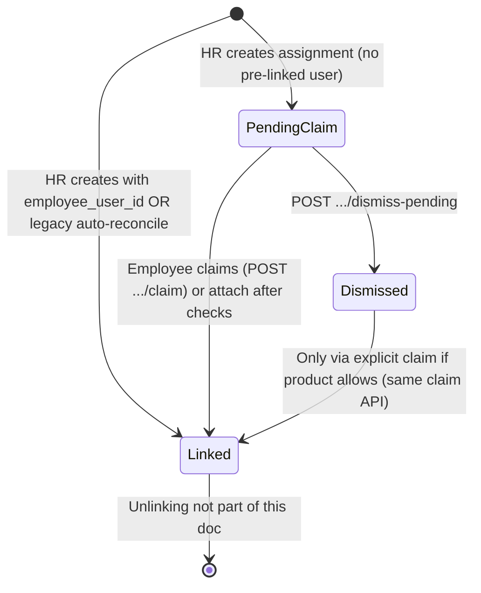

# Linked vs pending assignment model

This document describes how **account linkage** (auth user ↔ assignment) is represented after the `employee_link_mode` work, and how it composes with the existing **employee contact** and **assignment claim invite** tables.

---

## Final state model

### 1. Linked to the employee account (**linked**)

**Definition:** `case_assignments.employee_user_id` is set to the employee’s auth user id.

- This is the **authoritative** “this assignment belongs to this account” flag for API authorization and UI.
- `employee_link_mode` is cleared to `NULL` on link (`attach_employee_to_assignment`).
- An employee may have **many** linked rows; `GET /api/employee/assignments/current` returns:
  - `assignment`: primary (latest by `created_at` among linked),
  - `linked_assignments`: all linked rows (same ordering),
  - `pending_claim_assignments`: see below.

### 2. Pending explicit claim (**pending_claim**)

**Definition:** `employee_user_id` is **NULL** and `employee_link_mode = 'pending_claim'`.

- Used for HR/Admin-created assignments via **`create_assignment_with_contact_and_invites`** when **no** `employee_user_id` was supplied at creation.
- The row is tied to an **`employee_contacts`** record (`employee_contact_id`); claim invites (`assignment_claim_invites`) are still created as before.
- **`reconcile_pending_assignment_claims` does not** set `employee_user_id` for these rows. It still **links the contact** to the auth user (`linked_auth_user_id`) when identifiers match, so the employee can see pending work scoped to their contact.
- **Explicit link** happens via the existing **`POST /api/employee/assignments/{id}/claim`** flow (or `attach_employee_to_assignment` used internally after validation).

### 3. Claimed (invite bridge)

**Definition:** Rows in **`assignment_claim_invites`** with `status = 'claimed'` after a successful claim.

- This is the **invitation / claim bridge** state (per invite row), not a duplicate of `employee_user_id`.
- Ties together assignment, contact, and optional token lifecycle.

### 4. Expired / cancelled (invite bridge)

**Definition:** `assignment_claim_invites.status = 'revoked'` (and no pending/claimed row for that assignment, depending on product rules).

- **`is_assignment_auto_claim_blocked_by_revoked_invites`**: if **only** revoked invites exist for an assignment, **auto-reconcile** must not attach that assignment (legacy `NULL` link_mode path).
- HR cancelling an invite continues to use this mechanism.

### 5. Dismissed (optional employee action)

**Definition:** `employee_link_mode = 'dismissed'`, with `employee_user_id` still **NULL**.

- Set by **`POST /api/employee/assignments/{assignment_id}/dismiss-pending`** when the assignment was `pending_claim` and the contact is linked to the current user.
- Such rows are **excluded** from auto-reconcile and from **`pending_claim_assignments`** lists (query filters on `pending_claim` only).

---

## Column reference

| Column / table | Role |
|----------------|------|
| `case_assignments.employee_user_id` | Linked account (NULL until linked) |
| `case_assignments.employee_link_mode` | `NULL` (legacy auto-eligible), `pending_claim`, or `dismissed` |
| `case_assignments.employee_contact_id` | Canonical contact for HR-provisioned assignments |
| `employee_contacts.linked_auth_user_id` | Contact matched to auth user (login/reconcile) |
| `assignment_claim_invites` | Pending / claimed / revoked invite tokens per assignment |

---

## Transitions (high level)

- **Legacy auto-reconcile:** `employee_link_mode IS NULL` (or empty), `employee_user_id IS NULL`, and row is returned from `list_unassigned_assignments_for_employee_contact` / legacy identifier list → **`reconcile_pending_assignment_claims`** may call `attach_employee_to_assignment`.

---

## API summary

| Endpoint | Behavior |
|----------|----------|
| `GET /api/employee/assignments/current` | Reconcile (best effort), then returns `assignment`, `linked_assignments`, `pending_claim_assignments` |
| `POST /api/employee/assignments/{id}/claim` | Validates identity + invites; attaches user → **linked** |
| `POST /api/employee/assignments/{id}/dismiss-pending` | **pending_claim** → **dismissed** (same contact as user) |

---

## Design notes

- **No parallel identity system:** All paths still go through `assignment_claim_link_service`, `employee_contacts`, and `assignment_claim_invites`.
- **Backward compatibility:** Direct `create_assignment(...)` without setting `employee_link_mode` leaves `NULL`, preserving old auto-reconcile behavior for demos and migrations.
- **Frontend:** `employeeAPI.getCurrentAssignment()` typing includes optional `linked_assignments` and `pending_claim_assignments`; the dashboard can surface pending rows without treating them as `assignment.id` until the user claims.
