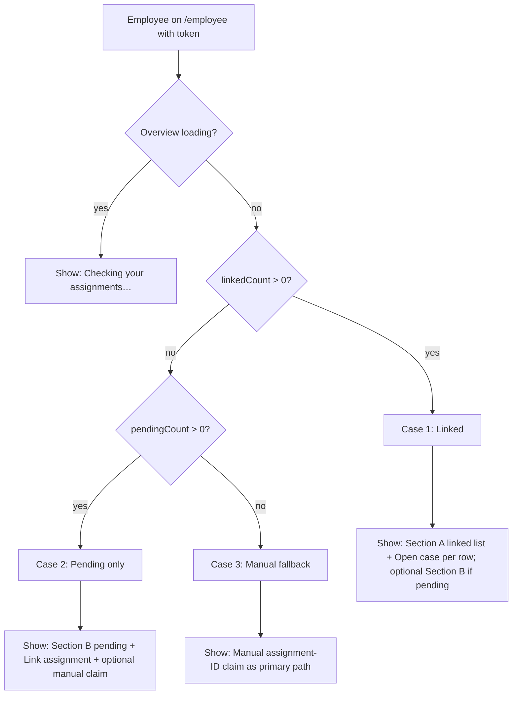

# Post-login routing rules (employee)

This document describes how an employee lands after authentication and how the app decides what to show **without URL churn or redirect loops**.

## Route and source of truth

- **Canonical post-login destination** for employees: `/employee/dashboard` (`EmployeeJourney`).
- **No extra redirects** are used to branch between “linked”, “pending only”, and “manual fallback”. The same route renders different sections based on counts from `GET` assignments overview (see `EmployeeAssignmentContext` → `employeeAPI.getAssignmentsOverview()`).
- **Counts**:
  - `linkedCount` — rows in `overview.linked`
  - `pendingCount` — rows in `overview.pending`
- **Primary linked assignment** (`assignmentId` in context) — `linked[0].assignment_id` for header **My case** and other global nav that needs a single active assignment. The hub itself lists every linked row and does not preload full case payloads.

## Decision tree

### Deterministic rules (implementation)

| Condition | Scenario | What the user sees on `/employee/dashboard` |
|-----------|----------|---------------------------------------------|
| `assignmentLoading === true` | Resolving | Full-width bootstrap card: **“Checking your assignments…”** (detail mentions loading case access). Rest of dashboard content is deferred until load completes. |
| `linkedCount > 0` | **Case 1 — has linked** | **No** generic assignment-ID-first experience. **Section A — Linked assignments** lists every linked row (overview fields only). **Open case** loads full case data on the case route, not on the hub. If there are also pending rows, **Section B** appears under Section A. |
| `linkedCount === 0` **and** `pendingCount > 0` | **Case 2 — pending only** | **No** auto-navigation into a case. **Section B — Pending assignments to link** with per-row **Link assignment**. Optional **manual claim** block below for edge cases (different login / UUID from HR). |
| `linkedCount === 0` **and** `pendingCount === 0` | **Case 3 — empty** | **Manual assignment-ID / claim** flow as fallback (primary path on the page). Explainer copy in **Assignment status** reflects “no automatic match”. |
| Overview request fails | Error path | Warning alert; counts cleared; user can retry refetch. Behavior matches **empty** for routing (no linked / no pending) but with visible error — manual claim remains available. |

## Avoiding redirect loops

- Bootstrap logic **does not** `navigate()` between scenarios; it only **renders** the appropriate sections on the dashboard.
- Navigation to `/employee/case/:id/...` happens only on **explicit user action** (e.g. **Open case**, **Link assignment**, manual claim) or existing auth/session guards — not from a mount effect that toggles between dashboard and claim page.
- Legacy paths (`/employee/journey`, old wizard dashboard alias) **one-shot** redirect to `/employee/dashboard` in `App.tsx` (replace), not in a feedback loop with assignment state.

## Related code

- `frontend/src/contexts/EmployeeAssignmentContext.tsx` — overview fetch, `linkedCount` / `pendingCount`, primary `assignmentId`.
- `frontend/src/pages/EmployeeJourney.tsx` — UI branching, loading cards, pending list, manual claim.
- `frontend/src/hooks/useAuth.ts` — post-login route for `EMPLOYEE` → `employeeDashboard` (`/employee/dashboard`).

## See also

- [linked-vs-pending-model.md](./linked-vs-pending-model.md) — domain meaning of linked vs pending.
- [employee-assignment-overview-endpoint.md](./employee-assignment-overview-endpoint.md) — API shape for overview.
- [employee-assignment-hub.md](./employee-assignment-hub.md) — hub sections, fields, and actions.
