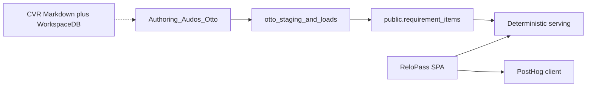

# ReloPass vs Karpathy proposals (25-item gap-map)

**Date:** 2026-09-12. Map and sequence against the ReloPass prod path (FastAPI + SPA + `public.requirement_items`). Case Command / CaseGate / CVR tables in Audos WorkspaceDB are **not** ReloPass prod.

**Constraint the original JSON ignores:** ReloPass already has a generation/serving split. Anything that fetches the web, runs a vision model, or calls an LLM at **requirement-serving** time is blocked by `scripts/check_serving_llm_isolation.py`. Put those jobs in authoring/ops, never in `requirements_builder` / `rules_engine` / `requirement_evaluation_service`.

## Status legend

- **Shipped** — in ReloPass prod path (FastAPI + SPA)
- **Partial** — related machinery exists; named deliverable does not
- **Audos-only** — WorkspaceDB / Case Command; does not compound in ReloPass
- **Stale** — proposal assumes a bug or gap that is already fixed or was never the real bug
- **Missing** — not in either layer as specified

## P0

| ID | Title | Status |
|---|---|---|
| RP-K-001 | ML-ready CVR schema | Partial / Audos-only — unified schema now in `docs/cvr/` |
| RP-K-002 | PostHog three-signal reward | Partial — events wired in SPA; formula in `docs/ml/reward-function.md` |
| RP-K-003 | Doc-vault upload | **Stale** — per-row upload shipped; Export all still dead |
| RP-K-004 | KG version control | Partial — changelog is on `requirement_items`, not WorkspaceDB |
| RP-K-005 | V0 threat model | Partial docs — still no single one-pager (not in this slice) |

## P1–P3 (summary)

006 relief UX: shipped on employee roadmap. 007 hallucination audit: `docs/sales/hallucination_audit_FR_NO.md` (catalog-grounded first pass). 008 Why-not-ChatGPT: SPA paywall + `docs/sales/why-not-chatgpt.md`. 015 calendar .ics: already shipped. 016 Case APIs: exist; do not add a parallel `/v1/`. 017 OS diagram: `docs/architecture/relocation-os.md`. P3 chatbot/HRIS/vision: do not start until v0→v1 criteria in `docs/ml/reward-function.md`.

## Sequence

**Demo Day:** 007, 008, 017 (and optional 009 numbers). **Before next real case:** 002, 006, 001, 004. **Do not rebuild:** 003, 015, 016.

## Store decision (RP-K-001)

CVRs stay **authoring artifacts** (repo JSON validated against `docs/cvr/cvr.schema.json`, plus existing Audos rows). Do **not** add `public.case_verification_reports` until there is a product UI that files them. Served catalog remains `requirement_items`; a CVR **points at** `requirement_id`s.
