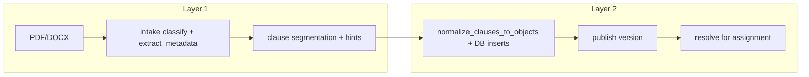

# Metadata vs decision layer (HR policy pipeline)

This document defines **two explicit layers** in the HR policy pipeline so “interesting extraction” is never mistaken for binding policy decisions.

---

## Layer 1 — document metadata / structure

**Purpose:** Help HR understand what the PDF *looks like it discusses* — triage, search, and labeling.

**Characteristics**

- Heuristic / keyword-driven (no guarantee of completeness or legal accuracy).
- Safe to show in HR intake UI as **preview**.
- **Must not** drive employee eligibility, caps, or service comparison on its own.

### Current Layer 1 sources

| Source | Fields / content |
|--------|------------------|
| **`policy_documents` row** | `detected_document_type`, `detected_policy_scope`, `version_label`, `effective_date`, `processing_status`, `extraction_error`, `filename`, `mime_type`, `storage_path`, `raw_text` (text is input to later stages, not a “decision”) |
| **`policy_documents.extracted_metadata`** | `detected_title`, `detected_version`, `detected_effective_date`, `mentioned_assignment_types`, `mentioned_family_status_terms`, `mentioned_benefit_categories`, `mentioned_units`, `likely_table_heavy`, `likely_country_addendum`, `likely_tax_specific`, `likely_contains_exclusions`, `likely_contains_approval_rules`, `likely_contains_evidence_rules` (+ legacy aliases merged by `normalize_extracted_metadata`) |
| **`policy_document_clauses.normalized_hint_json`** | `candidate_*` keys, flags such as `candidate_exclusion_flag`, `candidate_approval_flag`, `candidate_evidence_items`, etc. (see `policy_document_clauses._extract_normalized_hints`) |

### API surfacing (HR)

- `GET /api/hr/policy-documents/{doc_id}` returns the document with an explicit **`layer1`** object (`kind: document_metadata_profile`) that groups classification + a subset of `extracted_metadata`. **Top-level `extracted_metadata` remains** for backward compatibility; new clients should prefer `layer1` for clarity.
- Code: `backend/services/policy_pipeline_layers.py` (`enrich_policy_document_for_hr`).

---

## Layer 2 — decision-usable normalized policy output

**Purpose:** Machine-usable rules that downstream workflows can apply to a **specific assignment** and **specific services**.

**Characteristics**

- Stored in relational tables tied to a **published** `policy_version` (and optionally materialized snapshots).
- Produced by **normalization** from clauses + taxonomy logic, then **publish**, then **resolution** for an employee context.

### Current Layer 2 artifacts

| Artifact | Role |
|----------|------|
| **`company_policies`** | Container for the company policy (administrative record). |
| **`policy_versions`** | Version row; **`status = published`** is the gate for employees. |
| **`policy_benefit_rules`** | Per-benefit coverage signals: `benefit_key`, `benefit_category`, `calc_type`, amounts, currency, frequency, `metadata_json`, etc. |
| **`policy_exclusions`** | Blocks / domain exclusions tied to a version. |
| **`policy_rule_conditions`** | Eligibility gates (assignment type, family, duration, …). |
| **`policy_assignment_type_applicability`**, **`policy_family_status_applicability`**, **`policy_tier_overrides`** | Narrow applicability. |
| **`policy_evidence_requirements`** | Evidence expectations. |
| **`policy_source_links`** | Traceability from Layer 2 rows back to Layer 1 clauses. |
| **`resolved_assignment_policies`** + **`resolved_assignment_policy_benefits`** / **exclusions** | Per-assignment snapshot used by employee UI and comparison. |

### What drives employee comparison today

- **`policy_resolution.resolve_policy_for_assignment`** → resolved benefits (Layer 2).
- **`policy_service_comparison.compute_policy_service_comparison`** → reads resolved benefits by `benefit_key`; maps wizard service categories via `SERVICE_TO_BENEFIT`.

**Explicit rule:** comparison and eligibility endpoints must **not** read `extracted_metadata` or `mentioned_*` lists. Module docstrings in `policy_resolution.py` and `policy_service_comparison.py` state this.

---

## Transformations between layers

| Step | Input | Output | Notes |
|------|--------|--------|--------|
| Intake | File bytes | `policy_documents` + Layer 1 metadata | No benefit rules |
| Segment | `raw_text` | `policy_document_clauses` + `normalized_hint_json` | Hints are still Layer 1 |
| Normalize | Clauses + taxonomy | `policy_benefit_rules`, exclusions, conditions, … | **First Layer-2 decision graph** |
| Publish | Version row | `status = published` | Employee visibility gate |
| Resolve | Published rules + assignment context | `resolved_assignment_policy_*` | Per-employee truth for UI/compare |

### Narrow use of Layer 1 inside Layer 2 build

- **`layer1_fields_for_company_policy_shell`** (`policy_pipeline_layers.py`) passes only **title / version label / effective date** from `extracted_metadata` (and row fallbacks) into the **`company_policies`** shell. That labels the policy record; it does **not** imply coverage.
- Clause **hints** (Layer 1) are **inputs** to rule construction; the **decision** is the resulting `policy_benefit_rules` row (and related tables), not the hint JSON.

---

## Field mapping summary

| Layer 1 only (metadata) | Becomes / relates to Layer 2 (decision) |
|-------------------------|-------------------------------------------|
| `mentioned_benefit_categories` | **Not** copied 1:1; normalization may infer `benefit_key` from clause text + hints + `resolve_benefit_key` |
| `likely_contains_exclusions` | **Not** a block; actual blocks are `policy_exclusions` + resolution |
| `candidate_*` hints | Influence generated rules; replace with explicit rules after HR review if needed |
| `detected_title` / version / date | **Shell labels** on `company_policies` only (+ HR display) |

---

## Product / engineering rules

1. **HR “Detected metadata”** tab = Layer 1. Copy in the UI states it does not drive employee benefits (see frontend disclaimer on detected metadata).
2. **Employee HR Policy / Services comparison** = Layer 2 only (`resolved` / published path).
3. **`comparison_ready`** (see `minimum-normalized-policy-schema.md`) should be computed from **Layer 2** (or a future materialized package), not from `mentioned_*` lists.
4. New features that need “does the policy allow X?” must attach to **Layer 2** tables or resolved snapshots, not to `extracted_metadata`.

---

## Code index

| Concern | Module |
|---------|--------|
| Layer 1 constants + HR envelope | `backend/services/policy_pipeline_layers.py` |
| Layer 1 extraction | `backend/services/policy_document_intake.py` |
| Layer 1 clause hints | `backend/services/policy_document_clauses.py` |
| Layer 2 build | `backend/services/policy_normalization.py` |
| Layer 2 resolve | `backend/services/policy_resolution.py` |
| Layer 2 comparison | `backend/services/policy_service_comparison.py` |
| HR document GET envelope | `GET /api/hr/policy-documents/{doc_id}` in `backend/main.py` |

---

*Last aligned with in-repo refactor: explicit `layer1` on HR document GET + `layer1_fields_for_company_policy_shell` for policy shell labels.*
