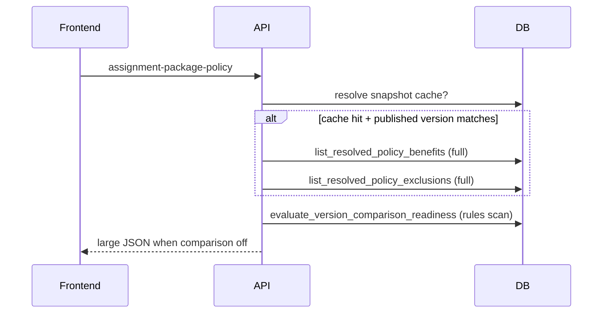
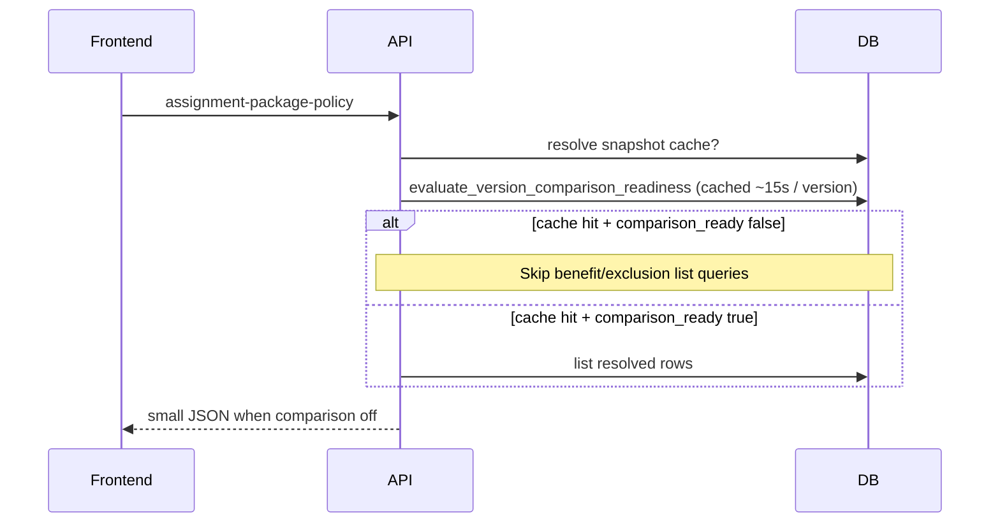

# Policy performance hardening (HR + employee)

This document records an audit of the **HR policy workspace**, **normalization/publish**, and **employee policy / Services** flows, and the concrete changes made to cut latency, duplicate work, and oversized payloads.

Related: [policy-degraded-states.md](./policy-degraded-states.md), [comparison-readiness-and-fallback.md](./comparison-readiness-and-fallback.md), [services-page-policy-consumption.md](./services-page-policy-consumption.md), [hr-to-employee-policy-verification.md](./hr-to-employee-policy-verification.md).

---

## 1. Audit summary

| Area | Issue | Severity |
|------|--------|----------|
| **Published policy discovery** | `get_company_policy_with_published_version` iterated every `company_policies` row and called `get_published_policy_version` per row (N+1 queries per candidate company). | High on tenants with many policy rows |
| **Employee resolution (cache hit)** | On every request, loaded **all** `resolved_policy_benefits` / `resolved_policy_exclusions` even when `comparison_available` is **false** (degraded employee UX does not render those rows). | High payload + 2 list queries |
| **Comparison readiness** | `evaluate_version_comparison_readiness` rescans published `policy_benefit_rules` on every call; employee pages can hit resolution + budget + services in one load. | Medium (duplicate CPU/IO) |
| **HR normalized payload** | `GET .../normalized` always loaded the full matrix (benefit rules, exclusions, evidence, conditions, applicability, source links) **and** ran published readiness — even when a client only needs **pipeline / publish headers**. | Medium |
| **Synchronous work** | Normalization and `resolve_policy_for_assignment` remain **explicit synchronous** steps (by design). No request path was changed to run full normalization inline where it was not already. | N/A (clarification) |
| **Indexes** | `policy_versions` lookups use `(policy_id)` + filter `status = 'published'`; helpful composite index missing on Postgres. `policy_documents` already had single-column `uploaded_at` index; composite `(company_id, uploaded_at)` helps company-scoped lists. | Medium |
| **Profile reads** | `_resolve_published_policy_for_employee` could call `get_profile_record` twice for the same employee in the write path. | Low |
| **Logging** | `list_company_ids_with_published_policy()` on “no policy” diagnostics touches distinct companies — acceptable but noisy; left as-is (could move to debug). | Low |
| **Cold resolution** | First `resolve_policy_for_assignment` still loads all published rules and persists the snapshot (required for consistency). **Skipping benefit row reads** when comparison is off does not remove that cost on first miss — only subsequent responses and payloads. | Documented below |

---

## 2. Before / after flows

### 2.1 Employee: assignment package policy (`GET /api/employee/me/assignment-package-policy`)

**Before**

**After**

**Moved off the hot path (comparison not ready, cache hit):**

- Full serialization of resolved benefit/exclusion rows (often hundreds of KB) — replaced with empty arrays while keeping `has_policy`, `policy` stub, `comparison_readiness`, and messages.

**Still on the critical path (by design):**

- First-time `resolve_policy_for_assignment` (cold cache) still computes and persists the snapshot (upload/classify/normalize/publish stages remain explicit elsewhere).

### 2.2 HR: normalized policy (`GET /api/company-policies/{id}/normalized`)

**Before:** Always loaded seven child collections for the latest draft version + published readiness.

**After:**

- `detail=summary` returns **policy + latest version + published version + optional readiness** with **empty** child arrays (no matrix fetch).
- `include_readiness=false` skips `evaluate_version_comparison_readiness` for cheap polling (e.g. banner-only UI).

Stages (**upload → classify → normalize → publish**) are unchanged; this only avoids **over-fetching** when the UI does not need the matrix.

### 2.3 Published policy lookup per company

**Before:** For each company candidate, O(n) policies × published lookup.

**After:** Single join query to pick the newest matching `(company_policy, published version)` pair, then two primary-key fetches for full rows.

---

## 3. Caching and reuse

| Mechanism | Where | Behavior |
|-----------|--------|----------|
| **Comparison readiness TTL cache** | `backend/services/policy_comparison_readiness.py` | In-process cache keyed by `policy_version_id`, **~15s** TTL, collapses duplicate scans when several endpoints resolve the same published version in one session. |
| **Invalidation** | Publish + benefit rule patch | `invalidate_comparison_readiness_cache(policy_version_id)` on publish (`_hr_publish_policy_version`) and after `PATCH .../benefits/{id}` so employees are not stuck with stale readiness for the TTL window. |
| **Resolved snapshot reuse** | Existing `resolved_assignment_policies` row when `policy_version_id` matches published | Unchanged; still the main reuse story for employees. |

---

## 4. Request count and payload improvements

| Change | Request / query impact | Payload impact |
|--------|-------------------------|----------------|
| **Employee cache hit + `comparison_ready: false`** | **−2** DB list queries (benefits, exclusions) | **Large reduction** (arrays empty; UI uses summary/degraded copy — see `EmployeeResolvedPolicyView`) |
| **Employee cache hit + `comparison_ready: true`** | Same as before | Same as before |
| **`get_company_policy_with_published_version`** | **O(n) → O(1)** join + 2 PK gets per company candidate | N/A |
| **`GET .../normalized?detail=summary`** | **−7** list queries (no matrix children) | **Small** response (headers + empty arrays) |
| **`include_readiness=false`** | Skips one rules scan for published version | N/A |
| **Postgres indexes** (`20260412100000_policy_performance_indexes.sql`) | Faster published-version and company document listing | N/A |

### 4.1 Frontend API client

`companyPolicyAPI.getNormalized(policyId, { detail: 'summary', includeReadiness: false })` is available for future HR sub-views that only need pipeline state without loading the matrix.

---

## 5. Employee Services policy context

When `has_policy` is true and `comparison_available` is false, resolution often returns **no benefit rows** (by design, to save work). `build_employee_services_policy_context` previously treated empty benefits as “no rule per category.” It now returns a dedicated **`comparison_not_ready`** determination per in-scope wizard category so Services does not mislabel policy state.

---

## 6. What we did *not* change (intentionally)

- **Normalization** remains an explicit action (and/or document pipeline), not inlined into unrelated GETs.
- **Cold `resolve_policy_for_assignment`** still performs full rule evaluation once to build the snapshot; further gains would require background jobs or lazier persistence (product/architecture change).
- **HR review workspace** still uses **full** `getNormalized` after edits/publish so the matrix stays consistent (summary mode is optional for new lightweight callers).

---

## 7. Files touched

| File | Change |
|------|--------|
| `backend/main.py` | Conditional resolved-row load; profile read reuse; `get_normalized_policy` query params; readiness precalc in finalize; cache invalidation hooks |
| `backend/database.py` | Optimized `get_company_policy_with_published_version` |
| `backend/services/policy_comparison_readiness.py` | TTL cache + invalidation helper |
| `backend/services/employee_services_policy_context.py` | `comparison_not_ready` branch |
| `supabase/migrations/20260412100000_policy_performance_indexes.sql` | Composite indexes |
| `frontend/src/api/client.ts` | `getNormalized` optional `detail` / `includeReadiness` |

---

## 8. Verification checklist

1. Employee with **published but not comparison-ready** policy: HR Policy tab and Services show correct **partial / not comparison** messaging (no empty “benefits” flash of wrong category copy).
2. Employee with **comparison-ready** policy: package limits and comparison UIs still receive non-empty benefits where expected.
3. HR: `GET /api/company-policies/{id}/normalized?detail=summary` returns expected publish headers.
4. After HR publishes or edits a benefit rule, comparison readiness updates within seconds (no stale 15s window after invalidation).
